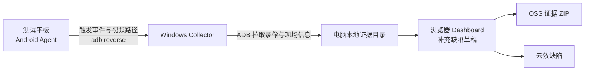

# FastBug 使用方式与实现方案

> 本文对应当前 `fastbug` 工程：Android Agent 负责屏幕现场采集，Windows Collector 负责证据封存、网页工作台、OSS 上传和云效缺陷提交。

## 1. 一句话说明

测试人员在平板上点击“报缺陷”，FastBug 会自动保留触发前约 60 秒与触发后约 10 秒的画面，同时在电脑侧采集截图、页面结构和日志；证据在本地确认后，可一键上传 OSS 并创建或更新云效缺陷。

被测应用不需要接入 FastBug SDK，也不需要能访问电脑网络。平板与电脑通过 USB ADB 连接，Agent 通过 `adb reverse` 访问仅监听在电脑本机的 Collector。



## 2. 使用者视角：一次完整测试怎么做

### 2.1 首次配置（每台电脑一次）

准备以下环境：

- Windows 电脑，已安装 Node.js、Android Platform Tools（`adb`）和可用的 `tar.exe`；
- Android 测试平板，已开启 USB 调试；
- 已安装 FastBug Agent；
- 可访问云效和 OSS 的网络；
- 一份云效项目配置，以及云效/OSS 凭据。

如需安装或更新采集端，用 Android Studio 打开 `android-agent/`，连接平板后执行 **Run app**。也可以在已构建出 Debug APK 后覆盖安装；`-r` 会保留 Agent 的 URL、Session 和待补传记录：

```powershell
adb -s <设备序列号> install -r .\android-agent\app\build\outputs\apk\debug\app-debug.apk
```

Android Agent 的最低 SDK 为 26，目标 SDK 为 34，当前包名为 `com.fastbug.captureagent`。

先确认设备可被电脑识别：

```powershell
adb devices
```

目标设备的状态应为 `device`，不是 `unauthorized` 或 `offline`。

#### 配置凭据

`collector/start.ps1` 从 **Windows 用户环境变量** 读取凭据，而不是只读取当前 PowerShell 会话。因此首次配置建议在 PowerShell 中执行：

```powershell
[Environment]::SetEnvironmentVariable('YUNXIAO_TOKEN', '<云效访问令牌>', 'User')
[Environment]::SetEnvironmentVariable('FASTBUG_OSS_ENDPOINT', '<OSS Endpoint>', 'User')
[Environment]::SetEnvironmentVariable('FASTBUG_OSS_ACCESS_KEY_ID', '<OSS AccessKey ID>', 'User')
[Environment]::SetEnvironmentVariable('FASTBUG_OSS_ACCESS_KEY_SECRET', '<OSS AccessKey Secret>', 'User')

# 可选：未设置时使用 zstt-test-tmp 与 fastbug
[Environment]::SetEnvironmentVariable('FASTBUG_OSS_BUCKET', '<OSS Bucket>', 'User')
[Environment]::SetEnvironmentVariable('FASTBUG_OSS_PREFIX', '<对象前缀>', 'User')
```

设置后关闭并重新打开 PowerShell。不要将 Token 或 AccessKey 写入源码、截图、Markdown 文档或 Git。

#### 配置云效项目

运行数据目录位于工程同级的：

```text
D:\project\collector-data\
```

从工程根目录创建配置文件：

```powershell
New-Item -ItemType Directory -Force ..\collector-data | Out-Null
Copy-Item .\collector\yunxiao.config.example.json ..\collector-data\yunxiao.config.json
```

填写 `yunxiao.config.json` 中的实际值：

| 字段 | 用途 |
| --- | --- |
| `domain` | 云效 OpenAPI 域名。 |
| `edition` | `center` 或 `region`。 |
| `organizationId` | 中心版云效必填的组织 ID。 |
| `spaceId` | 云效项目空间 ID。 |
| `workitemTypeId` | 缺陷工作项类型 ID。 |
| `assignedTo` | 默认负责人 userId。 |
| `defaults` | 固定验证者、参与者等默认值；留空时可在 Dashboard 选择。 |

### 2.2 每次测试前：启动 Collector

在工程根目录运行：

```powershell
.\collector\start.ps1 -Serial <设备序列号> -Package <被测应用包名>
```

可选参数：

```powershell
.\collector\start.ps1 `
  -Serial <设备序列号> `
  -Package <被测应用包名> `
  -Session <自定义会话 UUID> `
  -Port 52741
```

启动成功后，终端会输出本地地址、当前 Session ID，以及一条可直接执行的 `adb shell am start ...` 命令。执行该命令可将 Collector 地址和 Session ID 自动带入 Agent；也可以在 Agent 页面手工填写相同的值。

启动脚本会检查凭据、建立 `adb reverse`、启动 logcat 日志环，并启动只监听 `127.0.0.1` 的本地服务。Collector 运行期间会每 10 秒重建一次 reverse 规则，以应对 USB 短暂重连。

### 2.3 在平板开始采集

打开 FastBug Agent，依次完成：

1. 确认 Collector URL 为 `http://127.0.0.1:52741`，Session ID 与终端输出一致；
2. 首次使用时点击“授权悬浮窗”；
3. 点击“开始采集”，在 Android 系统弹窗中允许录屏；
4. 返回被测应用，屏幕会出现“报缺陷”悬浮按钮。

Android 13 及以上首次运行还需要允许通知权限。Agent 的“停止采集”会关闭录屏与悬浮窗。

### 2.4 发现问题时

点击悬浮按钮“报缺陷”。无需先填写表单，采集端会自动：

1. 立即通知 Collector 记录触发时刻；
2. 固定触发前的滚动录像；
3. 继续录制约 10 秒的触发后画面；
4. 合并为一份回放 MP4，并交给 Collector 拉取。

Collector 同时通过 ADB 保存截图、UI XML、窗口信息、设备属性、被测应用包信息，以及触发前后 logcat。

### 2.5 在网页中补全并提交缺陷

在电脑浏览器打开：

```text
http://127.0.0.1:52741/
```

操作顺序：

1. 在左侧“捕获记录”选择刚生成的记录；
2. 用“录像 / 截图 / 日志 / 打开文件夹”核对现场；
3. 填写标题、预期结果、实际结果、复现步骤、应用、严重程度、负责人、验证者、参与者、模块和备注；
4. 点击“保存本地草稿”；
5. 点击“提交至云效”。

“保存本地草稿”会把记录从 `local_draft` 标记为 `confirmed_locally`。只有本地确认后的草稿，才能上传 OSS 或提交云效。

提交云效时，Collector 会打包完整本地证据、上传 OSS、生成 7 天有效的下载链接，并创建云效缺陷；若该草稿已关联云效工作项，则更新原工作项。

## 3. 证据与数据留存规则

### 3.1 平板上会留下什么

| 情况 | 平板上的文件 | 处理规则 |
| --- | --- | --- |
| 正在采集 | 最近 6 个 10 秒视频分段，约 60 秒窗口 | 超出窗口的普通分段自动删除。 |
| 刚触发缺陷 | 触发前分段、触发后分段和合并回放 MP4 | 等待 Collector 拉取。 |
| Collector 成功响应 | 本次原始分段和回放 MP4 | 自动删除。 |
| 传输失败或电脑未连接 | 回放 MP4 及待补传信息 | 暂时保留，供自动/手动补传。 |
| 停止采集且没有待补传任务 | 当前滚动分段 | 自动删除。 |

设备端文件目录为：

```text
Android/data/com.fastbug.captureagent/files/Movies/fastbug/
```

因此，正常交付成功后设备不会累积历史录像；暂留的视频只用于当前滚动窗口或失败补传。Agent 会在 3 秒、8 秒、20 秒后自动尝试补传，用户也可点击“上报封存记录”手动再次上报。

> 注意：如果用户在“封存中”主动停止 Agent，该次尚未完成的采集不应视为已交付；请重新触发一次以获取完整证据。

### 3.2 电脑上会留下什么

电脑侧的证据是正式留存副本，保存在：

```text
D:\project\collector-data\captures\<capture-folder>\
├─ raw\
│  ├─ replay.mp4
│  ├─ video-segments\
│  ├─ screenshot.png
│  ├─ ui.xml
│  ├─ window.txt
│  ├─ device.txt
│  ├─ app.txt
│  ├─ logcat-at-trigger.txt
│  └─ logcat.txt
├─ manifest\
│  ├─ trigger.json
│  ├─ progress.json
│  └─ manifest.json
└─ draft\
   ├─ draft.json
   └─ draft.md
```

`manifest.json` 记录触发/就绪事件、文件相对路径、大小、SHA-256 摘要、失败项和处理状态。设备序列号以 SHA-256 摘要保存；原始分段和合并回放会同时留在电脑侧，便于后续复核。

如果某项 ADB 采集失败，`manifest.json` 的 `status` 会为 `partial_success`，并在 `failures` 中说明缺失项。此时应先检查证据完整性，再决定是否提交云效。

### 3.3 “清理未保存”会删除什么

Dashboard 左侧的“清理未保存”只列出 `local_draft` 状态的记录，即尚未点击“保存本地草稿”的初始草稿。

确认删除后，系统会物理删除该记录的整个电脑侧证据目录，包括录像、截图、日志、manifest 和草稿文件，无法通过 FastBug 恢复。已保存或已提交的记录不能通过该功能删除。

## 4. 系统如何实现

### 4.1 Android Agent

| 模块 | 责任 |
| --- | --- |
| `MainActivity.java` | 配置 Collector URL 与 Session ID；授权悬浮窗/录屏；开始和停止采集；显示状态；手动补报。 |
| `CaptureService.java` | 前台录屏服务、悬浮按钮、视频分段与合并、上报、自动重试、成功交付后的设备端清理。 |

录屏基于 Android `MediaProjection`。视频为 H.264 MP4，分段时长约 10 秒，最大宽度 1080、20 fps、5 Mbps。合并使用 `MediaExtractor` 与 `MediaMuxer`，不重新编码，减少等待时间和质量损耗。

证据传输期间，Agent 暂停常规轮转以保证源文件稳定；传输处理结束后会重新开启 10 秒轮转，避免慢速 USB 传输让某一个视频文件无限增长。

### 4.2 Windows Collector

| 模块 | 责任 |
| --- | --- |
| `collector/start.ps1` | 从 Windows 用户环境变量注入凭据，调用 Collector。 |
| `collector/index.js` | 本地 HTTP 服务、ADB 操作、日志环、现场证据采集、草稿与证据接口。 |
| `collector/dashboard.js` | Dashboard 页面、样式和浏览器端交互，不需要前端编译。 |
| `collector/oss.js` | 通过 `tar.exe` 打包 ZIP、签名并上传 OSS、生成临时下载链接。 |
| `collector/yunxiao.js` | 读取云效配置、同步成员/字段选项、创建或更新缺陷。 |

Collector 仅使用 Node.js 原生模块与 `adb`，没有 npm 依赖。它维护最大 12 MiB 的 logcat 内存日志环，并在收到 `triggered` 事件时立即采集现场信息；收到 `ready` 事件后拉取录像、生成本地草稿和证据清单。

### 4.3 Dashboard

Dashboard 是 Collector 提供的本地网页，包含：

- 顶部服务/设备状态和捕获概览；
- 左侧捕获队列与“清理未保存”；
- 右侧证据工具栏和缺陷草稿编辑区；
- 云效人员与字段的可搜索选择；
- 本地保存、云效提交/更新和本地证据文件夹跳转。

捕获列表大约每秒刷新一次；连接状态定时刷新。云效选项由 Collector 缓存约 5 分钟，减少重复请求。

## 5. 本地接口（供维护与排查使用）

服务只监听 `127.0.0.1`。

| 方法 | 地址 | 用途 |
| --- | --- | --- |
| `GET` | `/` | Dashboard。 |
| `GET` | `/health` | 健康检查。 |
| `GET` | `/v1/connection` | ADB、设备、Session 和 Collector 状态。 |
| `GET` | `/v1/captures` | 捕获记录列表。 |
| `GET` / `PUT` | `/v1/captures/:folder/draft` | 读取或保存本地草稿。 |
| `POST` | `/v1/captures/:folder/draft?action=upload-oss` | 上传证据 ZIP。 |
| `POST` | `/v1/captures/:folder/draft?action=submit-yunxiao` | 上传证据并创建/更新云效缺陷。 |
| `POST` | `/v1/captures/:folder/open-folder` | 在资源管理器中打开该证据目录。 |
| `DELETE` | `/v1/captures/:folder` | 删除未保存草稿及其完整证据目录。 |
| `GET` | `/evidence/:folder/:relativePath` | 浏览本地证据；录像支持 Range 请求。 |
| `GET` | `/v1/yunxiao/status`、`/v1/yunxiao/options` | 云效状态和可选项。 |
| `POST` | `/v1/events` | Agent 上报 `triggered` 与 `ready` 事件。 |

## 6. 日常检查与常见问题

### 6.1 开始测试前检查

- `adb devices` 显示平板状态为 `device`；
- Collector 正常启动，`http://127.0.0.1:52741/health` 可访问；
- Dashboard 显示设备“已连接”；
- Agent 可以开始采集并出现悬浮按钮；
- 触发一次后，网页中能查看录像、截图和日志；
- 测试环境中验证本地保存、OSS 上传和云效提交。

### 6.2 故障对照

| 现象 | 优先排查 |
| --- | --- |
| Collector 无法启动 | 检查 Node.js、`adb`、`tar.exe`，以及四个 Windows 用户环境变量和 `yunxiao.config.json`。 |
| Dashboard 显示设备未连接 | 执行 `adb devices`；检查 USB 授权；重启 Collector 以重建 `adb reverse`。 |
| Agent 提示会话不匹配 | 用 Collector 启动输出的命令重新打开 Agent，或核对 URL 与 Session ID。 |
| 没有悬浮按钮 | 授予悬浮窗权限；重新点击“开始采集”并允许系统录屏。 |
| 点“报缺陷”后没有记录 | 确认 Collector 未停止、USB 未断开；在 Agent 点击“上报封存记录”。 |
| 录像或日志不完整 | 检查 `manifest/manifest.json` 的 `failures`；ADB 拉取失败、USB 断开或 logcat 进程退出都会造成部分成功。 |
| 云效下拉为空或提交失败 | 检查 Token、云效组织/空间/工作项类型，以及电脑到云效的网络连通性。 |
| 更新网页或 Agent 后看不到变化 | 重启 Collector 并强制刷新浏览器；Agent 更新后需重新安装 APK。 |

## 7. 运行边界与安全要求

- 一个 Collector 实例对应一个指定设备、被测包名和 Session；多设备并行时，应分别使用端口、Session 和启动实例。
- 正常结束 Collector 时，在终端按 `Ctrl+C`；它会停止本地服务、logcat 进程和 reverse 重建任务。
- Android Agent 的包名当前固定为 `com.fastbug.captureagent`。Collector 会校验视频来源路径；改包名时必须同步调整 Collector 的路径校验。
- Agent 使用明文 HTTP 仅是为了经 ADB reverse 访问平板本机回环地址，不能把 Collector 指向不受信任的远程地址。
- 屏幕录像、截图、UI XML、日志与 OSS 下载链接可能含敏感业务数据，应按公司数据分级要求保存、分享与删除。
- OSS 下载链接有效期为 7 天；失效后再次提交会重新生成链接并更新云效工作项。
