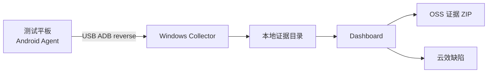

# FastBug

FastBug 是面向 Android 测试现场的本地证据采集工具：在平板上点击“报缺陷”，自动封存录像、截图、页面结构和日志；测试人员在电脑网页补全缺陷信息后，可提交至云效。

被测应用无需集成 SDK，也不需要与测试电脑处于同一网络。Android Agent 与 Windows Collector 通过 USB ADB 的 `reverse` 通道通信。



## 能做什么

- 保留触发前约 60 秒和触发后约 10 秒的屏幕录像；
- 自动采集截图、UI XML、窗口状态、设备/应用信息和 logcat；
- 在本地 Dashboard 查看证据、编辑和保存缺陷草稿；
- 打包证据上传 OSS，并创建或更新云效缺陷；
- 成功交付后自动清理平板录像；传输失败时支持自动与手动补传；
- 清理从未保存的本地草稿及其完整证据目录。

## 快速开始

### 1. 准备环境

- Windows：Node.js 18+、Android Platform Tools（`adb`）和 `tar.exe`；
- Android 平板：开启 USB 调试，安装 FastBug Agent；
- 可访问 OSS 与云效的网络；
- 已配置云效和 OSS 凭据。

确认设备已连接：

```powershell
adb devices
```

设备状态必须为 `device`。

### 2. 配置凭据与云效项目

Collector 从 Windows **用户环境变量**读取以下必填项：

```powershell
[Environment]::SetEnvironmentVariable('YUNXIAO_TOKEN', '<云效访问令牌>', 'User')
[Environment]::SetEnvironmentVariable('FASTBUG_OSS_ENDPOINT', '<OSS Endpoint>', 'User')
[Environment]::SetEnvironmentVariable('FASTBUG_OSS_ACCESS_KEY_ID', '<OSS AccessKey ID>', 'User')
[Environment]::SetEnvironmentVariable('FASTBUG_OSS_ACCESS_KEY_SECRET', '<OSS AccessKey Secret>', 'User')
```

设置后重新打开 PowerShell。将模板复制并填写实际云效项目参数：

```powershell
New-Item -ItemType Directory -Force ..\collector-data | Out-Null
Copy-Item .\collector\yunxiao.config.example.json ..\collector-data\yunxiao.config.json
```

真实凭据和 `collector/yunxiao.config.json` 不应提交到 Git。

### 3. 启动 Collector

在工程根目录执行：

```powershell
.\collector\start.ps1 -Serial <设备序列号> -Package <被测应用包名>
```

Collector 启动后会输出一条 `adb shell am start ...` 命令。执行该命令即可自动将 Collector URL 和 Session ID 写入 Agent。

### 4. 开始采集与提交

1. 在平板 Agent 中授权悬浮窗，点击“开始采集”，并允许系统录屏；
2. 在被测应用中点击悬浮“报缺陷”；
3. 浏览器打开 `http://127.0.0.1:52741/`；
4. 在“捕获记录”中查看证据，补全缺陷草稿并保存；
5. 点击“提交至云效”。

## 项目结构

| 路径 | 说明 |
| --- | --- |
| `android-agent/` | Android Studio 工程：配置页、悬浮触发、滚动录屏和失败补传。 |
| `collector/` | Node.js Collector：ADB 采集、本地服务、Dashboard、OSS 与云效集成。 |
| `docs/` | 使用说明、实施计划和运维文档。 |
| `../collector-data/` | 运行数据目录：云效配置、本地证据、草稿和 manifest；不在 Git 仓库中。 |

核心入口：

- `android-agent/app/src/main/java/com/fastbug/captureagent/MainActivity.java`：Agent 控制页；
- `android-agent/app/src/main/java/com/fastbug/captureagent/CaptureService.java`：录屏、封存、补传与设备端清理；
- `collector/index.js`：Collector HTTP 服务和证据编排；
- `collector/dashboard.js`：本地 Dashboard；
- `collector/start.ps1`：Windows 启动入口。

## 证据留存

| 位置 | 留存策略 |
| --- | --- |
| 平板 | 采集时仅保留最近约 60 秒；本次证据成功传到 Collector 后自动删除；失败时保留用于补传。 |
| 测试电脑 | 正式证据保存在 `D:\project\collector-data\captures\<capture-folder>\`，包括录像、截图、日志、manifest 和草稿。 |
| OSS | 提交云效时上传完整 ZIP；签名下载链接有效期为 7 天。 |

“清理未保存”会永久删除尚未保存草稿的完整电脑侧证据目录，请谨慎使用。

## 安全与边界

- Collector 只监听 `127.0.0.1`；
- Agent 的明文 HTTP 仅用于 ADB reverse 下的本机回环通信；
- 录像、截图、日志和 OSS 链接可能包含敏感业务信息，须按公司数据规范保存与分享；
- 一个 Collector 实例对应一个设备、被测包名和 Session；多设备并行需要使用独立端口、Session 和实例。

## 文档

- [完整使用方式与实现方案](docs/FastBug_使用方式与实现方案.md)
- [项目启用准备说明](docs/项目启用准备说明.md)
- [服务启动与重启说明](docs/服务启动与重启说明.md)
