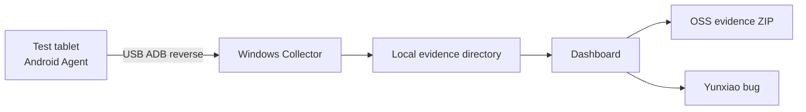

# FastBug

<p align="right">
  <a href="README.md">English</a> | <a href="README.zh-CN.md">简体中文</a>
</p>

FastBug is a local evidence-collection tool for Android test environments. Tap “Report Bug” on a tablet to automatically preserve video, screenshots, page structure, and logs. Testers can then complete the bug details in a desktop web page and submit the bug to Yunxiao.

The app under test does not need an SDK integration and does not need to be on the same network as the test computer. The Android Agent and Windows Collector communicate through the USB ADB `reverse` channel.


```mermaid
flowchart LR
    A[Test tablet\nAndroid Agent] -->|USB ADB reverse| B[Windows Collector]
    B --> C[Local evidence directory]
    C --> D[Dashboard]
    D --> E[OSS evidence ZIP]
    D --> F[Yunxiao bug]
```

## What it does

- Retains about 60 seconds of screen video before the trigger and about 10 seconds after it.
- Automatically collects screenshots, UI XML, window state, device and app information, and logcat output.
- Lets you view evidence and edit and save bug drafts in the local Dashboard.
- Packages evidence for OSS upload, then creates or updates Yunxiao bugs.
- Deletes tablet video automatically after successful delivery; supports automatic and manual retry when transfer fails.
- Deletes unsaved local drafts together with their complete evidence directories.

## Quick start

### 1. Prepare the environment

- Windows: Node.js 18+, Android Platform Tools (`adb`), and `tar.exe`.
- Android tablet: USB debugging enabled and FastBug Agent installed.
- Network access to OSS and Yunxiao.
- Configured Yunxiao and OSS credentials.

Confirm that the device is connected:

```powershell
adb devices
```

The device status must be `device`.

### 2. Configure credentials and the Yunxiao project

The Collector reads these required values from Windows **user environment variables**:

```powershell
[Environment]::SetEnvironmentVariable('YUNXIAO_TOKEN', '<Yunxiao access token>', 'User')
[Environment]::SetEnvironmentVariable('FASTBUG_OSS_ENDPOINT', '<OSS endpoint>', 'User')
[Environment]::SetEnvironmentVariable('FASTBUG_OSS_ACCESS_KEY_ID', '<OSS AccessKey ID>', 'User')
[Environment]::SetEnvironmentVariable('FASTBUG_OSS_ACCESS_KEY_SECRET', '<OSS AccessKey secret>', 'User')
```

Open a new PowerShell window after setting them. Copy the template and fill in the actual Yunxiao project parameters:

```powershell
New-Item -ItemType Directory -Force ..\collector-data | Out-Null
Copy-Item .\collector\yunxiao.config.example.json ..\collector-data\yunxiao.config.json
```

Do not commit real credentials or `collector/yunxiao.config.json` to Git.

### 3. Start the Collector

From the repository root, run:

```powershell
.\collector\start.ps1 -Serial <device serial number> -Package <app package name under test>
```

After the Collector starts, it prints an `adb shell am start ...` command. Run that command to automatically write the Collector URL and Session ID to the Agent.

### 4. Collect and submit

1. In the tablet Agent, grant overlay permission, tap “Start Capture,” and allow system screen recording.
2. In the app under test, tap the floating “Report Bug” button.
3. Open `http://127.0.0.1:52741/` in a browser.
4. View evidence in “Capture Records,” complete and save the bug draft.
5. Click “Submit to Yunxiao.”

## Project structure

| Path | Description |
| --- | --- |
| `android-agent/` | Android Studio project: configuration screen, floating trigger, rolling video capture, and retry after failure. |
| `collector/` | Node.js Collector: ADB collection, local service, Dashboard, OSS, and Yunxiao integration. |
| `docs/` | Usage instructions, implementation plan, and operations documentation. |
| `../collector-data/` | Runtime data directory for Yunxiao configuration, local evidence, drafts, and manifests; it is outside the Git repository. |

Key entry points:

- `android-agent/app/src/main/java/com/fastbug/captureagent/MainActivity.java`: Agent control screen.
- `android-agent/app/src/main/java/com/fastbug/captureagent/CaptureService.java`: video recording, preservation, retry, and device-side cleanup.
- `collector/index.js`: Collector HTTP service and evidence orchestration.
- `collector/dashboard.js`: local Dashboard.
- `collector/start.ps1`: Windows launch entry point.

## Evidence retention

| Location | Retention policy |
| --- | --- |
| Tablet | Only the most recent 60 seconds are retained during capture. The current evidence is deleted after successful transfer to the Collector; it is retained for retry if transfer fails. |
| Test computer | Final evidence is stored in `D:\project\collector-data\captures\<capture-folder>\`, including video, screenshots, logs, manifests, and drafts. |
| OSS | A complete ZIP is uploaded when the Yunxiao bug is submitted. The signed download link is valid for seven days. |

“Clear Unsaved” permanently deletes the complete computer-side evidence directory for drafts that have not been saved. Use it with care.

## Security and boundaries

- The Collector listens only on `127.0.0.1`.
- The Agent uses plaintext HTTP only for local loopback communication through ADB reverse.
- Video, screenshots, logs, and OSS links may contain sensitive business information; store and share them according to your organization’s data policies.
- One Collector instance is for one device, app package, and Session. To run multiple devices in parallel, use separate ports, Sessions, and instances.

## Documentation

- [Complete usage and implementation guide](docs/FastBug_使用方式与实现方案.md)
- [Project enablement preparation guide](docs/项目启用准备说明.md)
- [Service startup and restart guide](docs/服务启动与重启说明.md)
