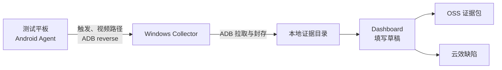
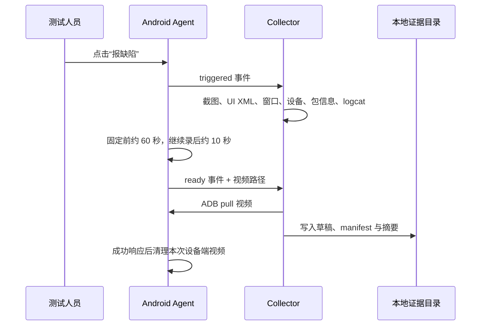

# FastBug：使用方式与实现方案

> FastBug 用于 Android 测试现场的快速取证：平板触发缺陷，电脑自动封存证据，测试人员在本地网页补全信息后提交云效。

## 1. 核心设计

FastBug 不修改被测应用，也不要求平板和电脑在同一网络。测试平板通过 USB ADB 与电脑相连；Android Agent 使用 `adb reverse` 访问电脑本机的 Collector。



| 组件 | 面向谁 | 负责什么 |
| --- | --- | --- |
| Android Agent | 测试人员 | 滚动录屏、悬浮“报缺陷”、录像封存与失败补传。 |
| Windows Collector | 测试电脑 | ADB 现场采集、证据校验、本地网页、OSS 和云效集成。 |
| Dashboard | 测试人员 | 查看证据、填写草稿、保存、清理未保存记录、提交云效。 |

## 2. 测试人员操作手册

### 2.1 每次测试前

1. USB 连接平板并开启 USB 调试。

   ```powershell
   adb devices
   ```

   目标设备必须显示为 `device`。

2. 在工程根目录启动 Collector。

   ```powershell
   .\collector\start.ps1 -Serial <设备序列号> -Package <被测应用包名>
   ```

   可按需要补充 `-Session <UUID>` 或 `-Port <端口>`。默认端口为 `52741`。

3. 复制终端输出的 `adb shell am start ...` 命令并执行。它会把 Collector 地址和 Session ID 写入 Agent；也可以在 Agent 页面手工填写。

4. 打开平板上的 FastBug Agent：首次使用时点击“授权悬浮窗”，再点击“开始采集”，并允许 Android 的录屏授权。

5. 在电脑浏览器打开 Dashboard：

   ```text
   http://127.0.0.1:52741/
   ```

### 2.2 发现缺陷后

1. 在被测应用内点击悬浮按钮“报缺陷”。
2. 等待左侧“捕获记录”出现新记录且显示证据已就绪。
3. 打开录像、截图和日志核对现场。
4. 补充标题、预期/实际结果、复现步骤、应用、严重程度、负责人、验证者、参与者、模块及备注。
5. 点击“保存本地草稿”。
6. 确认无误后点击“提交至云效”。

提交后的再次编辑与提交，会更新同一条云效缺陷，而不是创建重复工作项。

### 2.3 页面各操作的含义

| 操作 | 结果 |
| --- | --- |
| 开始采集 | 启动前台录屏服务和悬浮按钮。 |
| 授权悬浮窗 | 打开系统授权页；未授权时无法显示“报缺陷”。 |
| 补传封存记录 | 重新上报未成功送达电脑的录像。 |
| 停止采集 | 停止录屏并关闭悬浮按钮。 |
| 保存本地草稿 | 将草稿状态改为 `confirmed_locally`，允许 OSS/云效提交。 |
| 提交至云效 | 打包本地证据、上传 OSS，创建或更新云效缺陷。 |
| 清理未保存 | 仅删除从未保存的 `local_draft` 记录及其完整本地证据。 |

> “清理未保存”不可恢复，会删除该记录的录像、截图、日志、manifest 和草稿。已保存或已提交的记录不在清理范围内。

## 3. 证据如何产生和留存

### 3.1 触发时序



### 3.2 留存规则

| 位置 | 何时保留 | 何时清理 |
| --- | --- | --- |
| 平板滚动窗口 | 采集期间保留最近 6 个分段，约 60 秒 | 超出窗口自动删除；停止采集时也清理。 |
| 平板封存视频 | 点击“报缺陷”后，保留原始分段与回放 MP4 | Collector 成功处理后自动删除。 |
| 平板失败补传 | 电脑断开、Collector 不可用或传输失败时保留回放 | 成功补传后自动删除；自动重试间隔为 3 秒、8 秒、20 秒，也可手动补传。 |
| 电脑本地证据 | Collector 封存成功后保存 | 仅“清理未保存”可删除未保存草稿的整条证据。 |
| OSS ZIP | 提交云效时生成 | OSS 访问链接有效期为 7 天。 |

因此，正常使用时平板不会不断累积历史录像；电脑侧才是正式证据留存位置。

### 3.3 电脑侧目录结构

```text
D:\project\collector-data\captures\<capture-folder>\
├─ raw\
│  ├─ replay.mp4                 # 合并回放
│  ├─ video-segments\            # 原始分段，供复核
│  ├─ screenshot.png
│  ├─ ui.xml
│  ├─ window.txt
│  ├─ device.txt
│  ├─ app.txt
│  ├─ logcat-at-trigger.txt
│  └─ logcat.txt
├─ manifest\
│  ├─ trigger.json
│  ├─ progress.json
│  └─ manifest.json
└─ draft\
   ├─ draft.json
   └─ draft.md
```

`manifest.json` 保存事件、证据文件、大小、SHA-256 摘要和失败项。若状态为 `partial_success`，先查看 `failures` 判断哪些现场信息缺失，再决定是否提交。

## 4. 部署与配置

### 4.1 电脑依赖

- Node.js 18 或更高版本；
- Android Platform Tools，且 `adb` 在 `PATH`；
- 可用的 `tar.exe`，用于打包证据 ZIP；
- 到云效与 OSS 的网络连接。

### 4.2 Agent 安装与更新

用 Android Studio 打开 `android-agent/`，连接平板后执行 **Run app**。如已有 Debug APK，可覆盖安装并保留 URL、Session 与待补传记录：

```powershell
adb -s <设备序列号> install -r .\android-agent\app\build\outputs\apk\debug\app-debug.apk
```

当前 Agent 包名为 `com.fastbug.captureagent`，最低 SDK 为 26，目标 SDK 为 34。Collector 会校验该包名对应的视频路径；改包名时必须同步修改 Collector。

### 4.3 凭据与云效项目

启动脚本从 **Windows 用户环境变量** 读取以下必填项：

```powershell
[Environment]::SetEnvironmentVariable('YUNXIAO_TOKEN', '<云效访问令牌>', 'User')
[Environment]::SetEnvironmentVariable('FASTBUG_OSS_ENDPOINT', '<OSS Endpoint>', 'User')
[Environment]::SetEnvironmentVariable('FASTBUG_OSS_ACCESS_KEY_ID', '<OSS AccessKey ID>', 'User')
[Environment]::SetEnvironmentVariable('FASTBUG_OSS_ACCESS_KEY_SECRET', '<OSS AccessKey Secret>', 'User')
```

可选项：`FASTBUG_OSS_BUCKET`（默认 `zstt-test-tmp`）和 `FASTBUG_OSS_PREFIX`（默认 `fastbug`）。设置后重新打开 PowerShell。

云效配置文件位于：

```text
D:\project\collector-data\yunxiao.config.json
```

从模板创建：

```powershell
New-Item -ItemType Directory -Force ..\collector-data | Out-Null
Copy-Item .\collector\yunxiao.config.example.json ..\collector-data\yunxiao.config.json
```

至少填写 `domain`、`edition`、`spaceId`、`workitemTypeId`、`assignedTo`；中心版还需要 `organizationId`。`defaults` 可固定验证者和参与者。

## 5. 实现方案（维护人员）

### 5.1 Android Agent

| 文件 | 实现职责 |
| --- | --- |
| `android-agent/.../MainActivity.java` | 原生控制页：配置 URL/Session、授权、开始/停止、补传、状态展示。 |
| `android-agent/.../CaptureService.java` | 前台服务：`MediaProjection` 录屏、10 秒分段、6 段环形缓冲、悬浮按钮、视频合并、事件上报与清理。 |

视频采用 H.264 MP4，最大宽度 1080、20 fps、5 Mbps。回放由 `MediaExtractor` 和 `MediaMuxer` 无重新编码合并。传输期间暂停轮转以固定证据源；处理结束后恢复 10 秒轮转，避免慢速 USB 传输导致单一视频持续增长。

### 5.2 Collector 与 Dashboard

| 文件 | 实现职责 |
| --- | --- |
| `collector/start.ps1` | 读取用户环境变量，启动 Node Collector。 |
| `collector/index.js` | 本地 HTTP 服务、ADB 操作、日志环、证据封存、草稿和提交编排。 |
| `collector/dashboard.js` | 自包含的 Dashboard HTML/CSS/浏览器交互。 |
| `collector/oss.js` | ZIP 打包、OSS HMAC-SHA1 签名上传、7 天临时链接。 |
| `collector/yunxiao.js` | 云效选项缓存、缺陷创建和更新。 |

Collector 没有 npm 依赖，只使用 Node.js 原生模块和 `adb`。它维护最大 12 MiB 的 logcat 环形日志，并且每 10 秒重新应用一次 `adb reverse`。

### 5.3 本地 HTTP 接口

服务只监听 `127.0.0.1`。

| 方法 | 地址 | 用途 |
| --- | --- | --- |
| `GET` | `/`、`/health` | Dashboard 与健康检查。 |
| `GET` | `/v1/connection`、`/v1/captures` | 连接状态与捕获队列。 |
| `GET` / `PUT` | `/v1/captures/:folder/draft` | 读取/保存草稿。 |
| `POST` | `.../draft?action=upload-oss` | 上传证据 ZIP。 |
| `POST` | `.../draft?action=submit-yunxiao` | 创建或更新云效缺陷。 |
| `POST` | `/v1/captures/:folder/open-folder` | 打开本地证据目录。 |
| `DELETE` | `/v1/captures/:folder` | 删除未保存草稿及完整证据目录。 |
| `GET` | `/evidence/:folder/:relativePath` | 提供录像、截图和日志；录像支持 Range 请求。 |
| `POST` | `/v1/events` | 接收 Agent 的 `triggered`、`ready` 事件。 |

## 6. 快速排障

| 现象 | 处理方式 |
| --- | --- |
| Collector 无法启动 | 检查 Node.js、`adb`、`tar.exe`、四项用户环境变量和云效配置文件。 |
| Dashboard 显示未连接 | 执行 `adb devices`；检查 USB 授权；重启 Collector 以重建 `adb reverse`。 |
| Agent 提示 Session 不匹配 | 使用 Collector 输出的 `adb shell am start ...` 命令重新打开 Agent。 |
| 没有悬浮按钮 | 授权悬浮窗并重新开始采集，确认已允许系统录屏。 |
| 触发后没有记录 | 确认 Collector 和 USB 连接仍在；在 Agent 点击“补传封存记录”。 |
| 录像或日志缺失 | 查看该记录 `manifest/manifest.json` 的 `failures`。 |
| 云效下拉为空/提交失败 | 检查 Token、云效组织/空间/工作项类型和网络连通性。 |

## 7. 安全与运行边界

- 一个 Collector 实例对应一个设备、被测包名与 Session。多设备同时使用时，分别使用独立端口、Session 和实例。
- Agent 的明文 HTTP 仅用于 ADB reverse 下的本机回环通信，不能指向不受信任的远程地址。
- 屏幕录像、截图、UI XML、日志和 OSS 链接可能包含敏感数据，须按公司数据规范保存、分享和删除。
- 正常停止 Collector 时，在终端按 `Ctrl+C`；会停止 HTTP 服务、logcat 和 reverse 重建任务。
